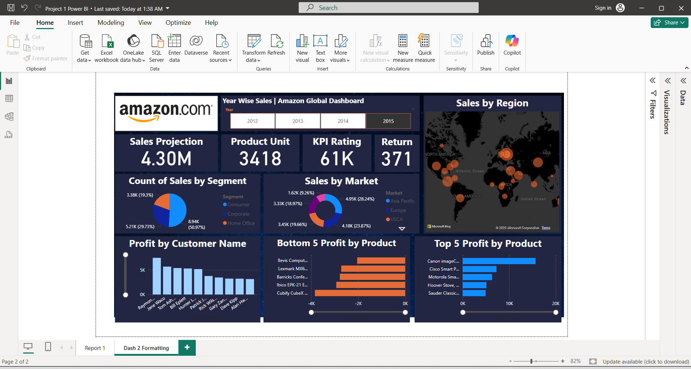

# Amazon Global Store – Power BI Project

## Overview
This is an end-to-end Power BI dashboard project using Amazon Global Superstore data. It visualizes key business metrics like sales, profit, region-wise performance, product categories, and customer segments.

## Tools Used
- Power BI Desktop
- Power BI Service
- Excel
- DAX
- Power Query Editor

## Features
- Interactive dashboard with slicers, filters, KPIs, and charts
- Data cleaning and transformation using Power Query
- Data modeling with DAX
- Exported PDF & PPT reports for business sharing
- Published live report on Power BI Service

## Key Insights
- Top-selling categories and subcategories
- Region-wise and state-wise profit & loss zones
- Key customer segments contributing to revenue
- Monthly trends in sales and profit

## Dashboard Screenshot

## Author
**Ayyam Raza**  
[LinkedIn Profile](https://www.linkedin.com/in/learner-cse-232621243)
